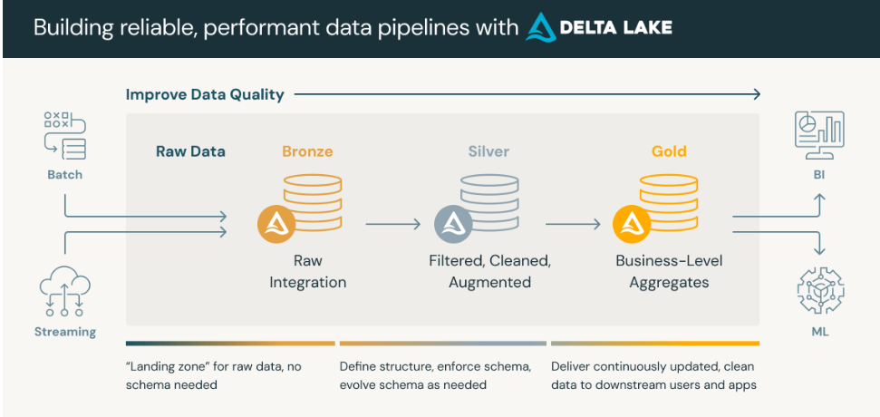

# Pipeline example
The components of the `storage_stream` setup are reused and a pipeline example is built, based on the same basic building-blocks: [spark](https://spark.apache.org/), [jupyter](https://jupyter.org/), [minio](https://min.io/), [kafka](https://kafka.apache.org/).

URLs:
- 📌 Jupyter Notebook: http://localhost:8888 (needs token, look in console-log)
- 📌 Spark UI: http://localhost:4040 (for active sessions)
- 📌 MinIO Console: http://localhost:9001 (User: admin, Password: password)
- 📌 Kafka Broker: localhost:9092

## Pipeline architecture
The example implements a three-staged setup also known as [medallion architecture](https://www.databricks.com/glossary/medallion-architecture). 



## 1. Start the environment
To start the necessary services use docker compose (or podman, or ...).

> [!NOTE]  
> **Docker**: The compose files where created on Linux with [docker-ce](https://docs.docker.com/engine/install/ubuntu/), tested on Windows with [Docker-Desktop](https://docs.docker.com/desktop/setup/install/windows-install/) on Mac with [OrbStack](https://orbstack.dev/). Other container-environments like podman may work/may need adaptions.

```bash
# uses the file compose.yaml|.yml by default
docker compose rm # remove old containers if available
docker compose up --build # start the spark environment and ensure container is built
```

The output is similar to this:

```
jupyter-spark  | Entered start.sh with args: start-notebook.py
jupyter-spark  | Running hooks in: /usr/local/bin/start-notebook.d as uid: 1000 gid: 100
jupyter-spark  | Done running hooks in: /usr/local/bin/start-notebook.d
jupyter-spark  | Running hooks in: /usr/local/bin/before-notebook.d as uid: 1000 gid: 100
jupyter-spark  | Sourcing shell script: /usr/local/bin/before-notebook.d/10activate-conda-env.sh
minio          | MinIO Object Storage Server
minio          | Copyright: 2015-2025 MinIO, Inc.
minio          | License: GNU AGPLv3 - https://www.gnu.org/licenses/agpl-3.0.html
minio          | Version: RELEASE.2025-04-08T15-41-24Z (go1.24.2 linux/amd64)
minio          | 
minio          | API: http://172.20.0.4:9000  http://127.0.0.1:9000 
minio          | WebUI: http://172.20.0.4:9001 http://127.0.0.1:9001  
minio          | 
minio          | Docs: https://docs.min.io
jupyter-spark  | Sourcing shell script: /usr/local/bin/before-notebook.d/10spark-config.sh
jupyter-spark  | Done running hooks in: /usr/local/bin/before-notebook.d
jupyter-spark  | Executing the command: start-notebook.py
jupyter-spark  | Executing: jupyter lab

[...]

jupyter-spark  | [C 2025-04-21 12:41:07.513 ServerApp] 
jupyter-spark  |     
jupyter-spark  |     To access the server, open this file in a browser:
jupyter-spark  |         file:///home/jovyan/.local/share/jupyter/runtime/jpserver-7-open.html
jupyter-spark  |     Or copy and paste one of these URLs:
jupyter-spark  |         http://localhost:8888/lab?token=b266e68134ba8768e8e8f6dc018086477919e05e6ef27184
jupyter-spark  |         http://127.0.0.1:8888/lab?token=b266e68134ba8768e8e8f6dc018086477919e05e6ef27184

```

## 2. Notebooks
The folder `src/notebooks` contains notebooks to interact with the environment:


### Streaming
To use the kafka_stream notebook the Kafka topic needs to be available and messages need to be produced. To enable this scripts are available in the folder `src/scripts`.

- *kafka_create_topic*
- *kafka_console_producer*
- *kafka_console_consumer*

When the kafka notebook is executed, messages from the kafka are read and displayed directly in the notebook. 


> [!NOTE]  
> **PowerShell**: The provided PowerShell scripts use the [current/modern PowerShell variant](https://github.com/PowerShell/PowerShell) and are not tested with the legacy PowerShell provided by Windows ([Differences between Windows PowerShell 5.1 and PowerShell 7.x](https://learn.microsoft.com/en-us/powershell/scripting/whats-new/differences-from-windows-powershell?view=powershell-7.5)).