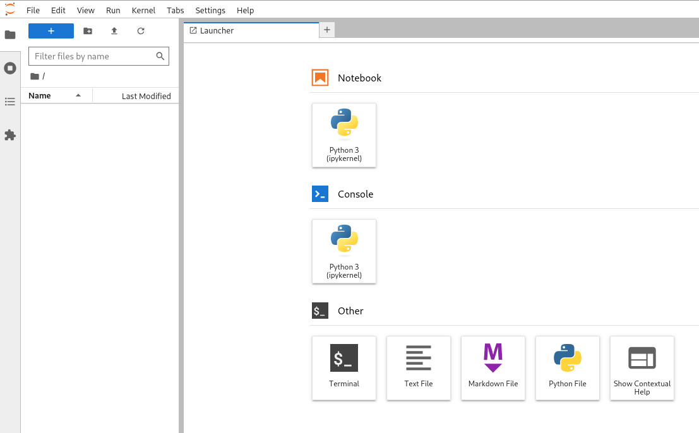

# Basic spark, jupyter Setup
The compose file defines a simple [spark](https://spark.apache.org/) setup with a master-node and one worker. In addition [jupyter](https://jupyter.org/) notebooks are enabled to interact via python with the spark-cluster.

URLs:
- 📌 Jupyter Notebook: http://localhost:8888
- 📌 Spark Master UI: http://localhost:8080


## Start the environment
To start the necessary services use docker compose (or podman, or ...).

```bash
# uses the file compose.yaml|.yml by default
docker compose rm # remove old containers if available
docker compose up # start the spark environment
```

The output is similar to this:

```
spark-master  | spark 16:51:26.08 INFO  ==> 
spark-master  | spark 16:51:26.08 INFO  ==> Welcome to the Bitnami spark container
spark-master  | spark 16:51:26.08 INFO  ==> Subscribe to project updates by watching https://github.com/bitnami/containers
spark-master  | spark 16:51:26.08 INFO  ==> Did you know there are enterprise versions of the Bitnami catalog? For enhanced secure software supply chain features, unlimited pulls from Docker, LTS support, or application customization, see Bitnami Premium or Tanzu Application Catalog. See https://www.arrow.com/globalecs/na/vendors/bitnami/ for more information.
spark-master  | spark 16:51:26.09 INFO  ==> 
spark-master  | spark 16:51:26.12 INFO  ==> ** Starting Spark setup **
spark-master  | spark 16:51:26.13 INFO  ==> Generating Spark configuration file...
spark-master  | find: '/docker-entrypoint-initdb.d/': No such file or directory
spark-master  | spark 16:51:26.13 INFO  ==> No custom scripts in /docker-entrypoint-initdb.d
spark-master  | spark 16:51:26.14 INFO  ==> ** Spark setup finished! **
spark-master  | 
spark-master  | spark 16:51:26.14 INFO  ==> ** Starting Spark in master mode **
spark-master  | starting org.apache.spark.deploy.master.Master, logging to /opt/bitnami/spark/logs/spark--org.apache.spark.deploy.master.Master-1-spark-master.out
spark-master  | Spark Command: /opt/bitnami/java/bin/java -cp /opt/bitnami/spark/conf/:/opt/bitnami/spark/jars/* -Xmx1g org.apache.spark.deploy.master.Master --host spark-master --port 7077 --webui-port 8080
spark-master  | ========================================
jupyter       | Entered start.sh with args: start-notebook.py
jupyter       | Running hooks in: /usr/local/bin/start-notebook.d as uid: 1000 gid: 100

[...]
```

## Access jupyter notebook-UI
To access the notebooks open the URL http://localhost:8888/ in the browser. A token is needed to get access; the token-link can be found in the docker compose output.


```
jupyter       | [I 2025-04-05 14:38:32.895 ServerApp] Jupyter Server 2.8.0 is running at:
jupyter       | [I 2025-04-05 14:38:32.895 ServerApp] http://bc88a31e5b4b:8888/lab?token=9083b1cdf3e2cabf0da9c6bd817429ddd442fd9580645e2e
jupyter       | [I 2025-04-05 14:38:32.895 ServerApp]     http://127.0.0.1:8888/lab?token=9083b1cdf3e2cabf0da9c6bd817429ddd442fd9580645e2e
```

After entering the token and choosing a password the notebook UI is available:



## Test spark with python
Create your first notebook using [pyspark](https://spark.apache.org/docs/latest/api/python/index.html):

```python
from pyspark.sql import SparkSession

spark = SparkSession.builder \
    .appName("TestSpark") \
    .getOrCreate()

df = spark.createDataFrame([(1, "Alice"), (2, "Bob")], ["id", "name"])
df.show()
``` 

The output of the this command should be similar like this:

```
+---+-----+
| id| name|
+---+-----+
|  1|Alice|
|  2|  Bob|
+---+-----+
```